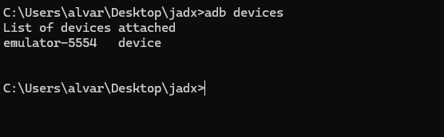
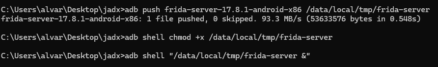
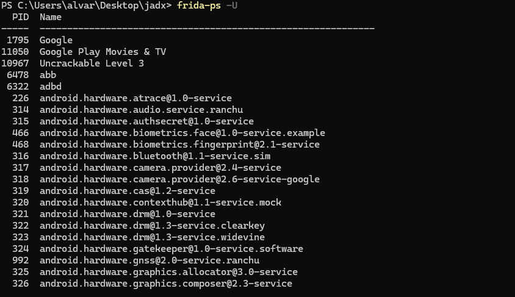
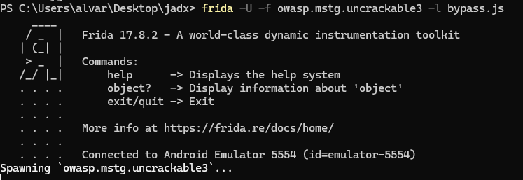
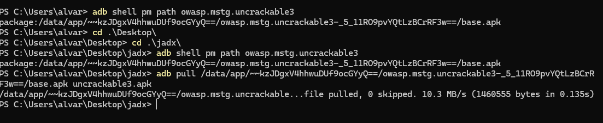
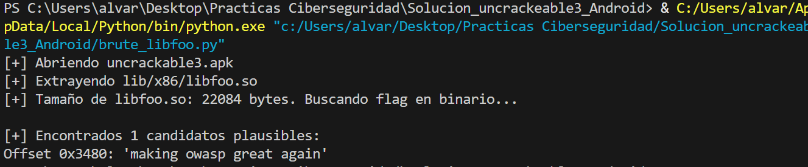
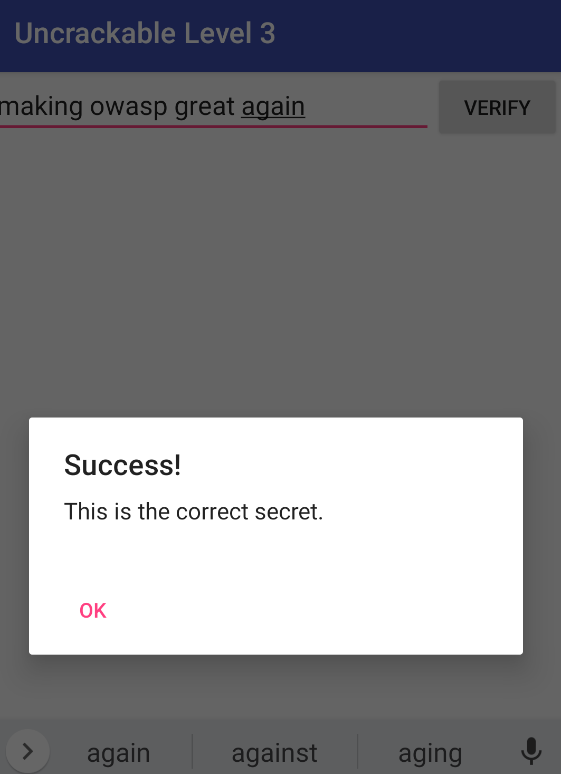

# Guia Paso a Paso: Resolucion del Reto UnCrackable Level 3

**Alumno:** Alvaro Pavon Martinez
**Materia:** Puesta en produccion segura
**Objetivo:** Obtener el codigo secreto oculto en "UnCrackable Level 3" mediante ingenieria inversa y hacking dinamico.

---

## Indice
1. [Preparacion del Entorno](#1-preparaci%C3%B3n-del-entorno)
2. [Fase 1: Analisis Estatico (JADX)](#2-fase-1-an%C3%A1lisis-est%C3%A1tico-jadx)
3. [Fase 2: Bypass de Seguridad Inicial (Java)](#3-fase-2-bypass-de-seguridad-inicial-java)
4. [Fase 3: Engañando a la Libreria Nativa (strstr)](#4-fase-3-enga%C3%B1ando-a-la-librer%C3%ADa-nativa-strstr)
5. [Fase 4: El Hueso Duro (Anti-Tampering y pthread)](#5-fase-4-el-hueso-duro-anti-tampering-y-pthread)
6. [Fase 5: Extraccion y Descifrado de la Flag (XOR)](#6-fase-5-extracci%C3%B3n-y-descifrado-de-la-flag-xor)
7. [Anexo: Script de Bypass Final (Frida)](#anexo-script-de-bypass-final-frida)
8. [Conclusion](#8-conclusi%C3%B3n)

---

## 1. Preparacion del Entorno
Antes de empezar, es necesario configurar las herramientas de comunicacion e instrumentacion.

### 1.1. Conexion con el dispositivo
Primero verificamos que el emulador sea visible via ADB:
```bash
adb devices
```


### 1.2. Instalacion de Frida-Server
Para poder inyectar codigo, necesitamos el servidor de Frida corriendo en el Android (con permisos de root):
```bash
# Copiamos el binario al dispositivo
adb push frida-server-17.8.1-android-x86 /data/local/tmp/frida-server

# Damos permisos de ejecucion
adb shell chmod +x /data/local/tmp/frida-server

# Ejecutamos el servidor en segundo plano
adb shell "/data/local/tmp/frida-server &"
```


### 1.3. Verificacion de Frida
Comprobamos que Frida puede ver los procesos del movil:
```bash
frida-ps -U
```


---

## 2. Fase 1: Analisis Estatico (JADX)
Desopilamos el APK para buscar pistas en el codigo fuente.

1.  Abrimos la aplicacion con JADX: `jadx-gui uncrackable3.apk`.
2.  **Hallazgo 1**: En `MainActivity`, vemos que se carga `libfoo.so`.
3.  **Hallazgo 2**: Identificamos la clave XOR: `pizzapizzapizzapizzapizz`.
4.  **Hallazgo 3**: Vemos que la validacion ocurre en el metodo nativo `bar(byte[] input)`.

---

## 3. Fase 2: Bypass de Seguridad Inicial (Java)
Creamos un archivo llamado [bypass.js](bypass.js) con los hooks necesarios. Para lanzar la aplicacion ignorando las protecciones de Java, usamos el siguiente comando:

```bash
frida -U -f owasp.mstg.uncrackable3 -l bypass.js
```


**Codigo Java Hooked**:
*   Interceptamos `System.exit()` para evitar cierres.
*   Interceptamos `MainActivity.showDialog` para que no bloquee la UI.

---

## 4. Fase 4: El Hueso Duro (Anti-Tampering)
La libreria `libfoo.so` tiene protecciones avanzadas. Si detecta a Frida, crashea. Para evitarlo, bloqueamos la creacion de hilos de vigilancia.

**Instrucción**: El script [bypass.js](bypass.js) debe incluir el hook de `pthread_create` para detectar cuando `libfoo.so` intenta lanzar un hilo y devolver `0` (exito) sin ejecutarlo realmente.

---

## 5. Fase 5: Extraccion y Descifrado de la Flag (XOR)
Como no es posible leer la flag directamente por la ofuscacion, la extraemos del binario.

### 5.1. Extraer la libreria del movil
Primero localizamos donde esta instalada la app y descargamos el APK a nuestro PC:
```bash
# Encontrar la ruta del APK
adb shell pm path owasp.mstg.uncrackable3

# Descargar el APK (sustituye [ruta] por la salida del comando anterior)
adb pull /data/app/.../base.apk uncrackable3.apk
```


### 5.2. Ejecutar el Brute-Force XOR
He creado un script de Python ([brute_libfoo.py](brute_libfoo.py)) que abre el APK y extrae la librería `libfoo.so`. 
En lugar de usar la clave original `"pizzapizzapizzapizzapizz"`, este script utiliza una matriz de bytes exacta porque la librería nativa `libfoo.so` **muta la clave en memoria en tiempo de ejecución**. Buscamos secuencias que, al aplicarles XOR con esta nueva clave mutada, den el resultado legible de la flag.

**Comando**:
```bash
python brute_libfoo.py
```


**Resultado obtenido**:
Al ejecutarlo, el script nos devuelve:
> **`making owasp great again`**

---

## Anexo: Análisis Detallado del Script de Bypass Final (Frida)

Este archivo, [bypass.js](bypass.js), es el corazón de la solución. Utiliza técnicas de instrumentación dinámica tanto en la capa Java como en la capa Nativa (C/C++) para anular las protecciones del reto.

### 1. Bypass de Detección en Capa Nativa (`strstr`)
```javascript
function hookStrstr() { ... }
```
La aplicación utiliza la función `strstr` de la librería estándar de C para buscar cadenas como "frida", "xposed" o "su" en los mapas de memoria y archivos del sistema. Nuestro hook intercepta estas llamadas:
- **onEnter**: Lee los argumentos (pajar y aguja). Si detecta una búsqueda de herramientas de hacking, activa una bandera interna.
- **onLeave**: Si la bandera está activa, reemplaza el valor de retorno por `0` (NULL), haciendo creer a la aplicación que no ha encontrado rastro de Frida o Root.

### 2. Bloqueo de Hilos Anti-Tampering (`pthread_create`)
```javascript
function hookPthreadCreate() { ... }
```
Esta es la protección más agresiva de UnCrackable 3. La librería `libfoo.so` lanza hilos en segundo plano que monitorizan constantemente la integridad del proceso. Si detectan cambios, cierran la app.
- **Estrategia**: Interceptamos la creación de cualquier hilo. Si el código que va a ejecutar el hilo pertenece a `libfoo.so`, el hook devuelve `0` (éxito) inmediatamente **sin ejecutar el hilo real**. Esto "congela" la seguridad de la librería nativa.

### 3. Captura de Comparaciones (`strncmp`)
```javascript
function hookStrncmp() { ... }
```
Monitoriza las llamadas a `strncmp` provenientes exclusivamente de `libfoo.so`. Esto nos permite ver en tiempo real qué cadenas está comparando la aplicación, lo cual es vital para identificar dónde se procesa la clave secreta (aunque en este nivel la clave final se autogenera, es útil para depuración).

### 4. Bypass de Seguridad en Capa Java
```javascript
Java.perform(function () { ... });
```
Dentro de este bloque gestionamos las protecciones estándar de Android:
- **`Debug.isDebuggerConnected`**: Siempre devuelve `false` para evadir la detección de depuradores JDWP.
- **`System.exit`**: Se bloquea para que, aunque una detección secundaria tenga éxito, la aplicación no pueda cerrarse sola.
- **`MainActivity.showDialog`**: Evita que aparezcan los pop-ups de "Root Detected" que bloquean la interacción del usuario.
- **`CodeCheck.check_code`**: Forzamos a que siempre devuelva `true`, permitiendo que cualquier entrada sea aceptada por la interfaz.

### 5. Extracción Automática del Secreto (`extractSecret`)
```javascript
function extractSecret() { ... }
```
Este algoritmo realiza un volcado dinámico de la memoria de `libfoo.so` y busca el secreto mediante fuerza bruta sobre el cifrado XOR:
1.  **Enumeración**: Localiza todos los rangos de memoria (lectura/escritura) de la librería.
2.  **Escaneo XOR**: Recorre la memoria byte a byte aplicando la operación XOR con la clave `"pizzapizzapizzapizzapizz"`.
3.  **Validación**: Si el resultado es una cadena de 24 caracteres ASCII imprimibles y coherentes, la identifica automáticamente como la **Secret Flag**.

---

### Código Completo del Script de Bypass (`bypass.js`)

```javascript
/*
 * UnCrackable Level 3 - Final Bypass Script
 * Desarrollado para: Puesta en producción segura
 */

console.log("[*] UnCrackable3 final bypass activo");

function hookStrstr() {
    const strstr = Module.findGlobalExportByName("strstr");
    if (!strstr) return;

    Interceptor.attach(strstr, {
        onEnter: function (args) {
            this.hide = false;
            try {
                const haystack = args[0].readCString();
                const needle = args[1].readCString();
                if (needle) {
                    const n = needle.toLowerCase();
                    if (n.indexOf("frida") !== -1 || n.indexOf("xposed") !== -1 || n.indexOf("su") !== -1) {
                        this.hide = true;
                    }
                }
            } catch (e) {}
        },
        onLeave: function (retval) {
            if (this.hide) {
                retval.replace(ptr(0));
            }
        }
    });
    console.log("[+] Hook strstr activo (Antidetect)");
}

function hookPthreadCreate() {
    const pthread_create = Module.findGlobalExportByName("pthread_create");
    if (!pthread_create) return;

    const pthread_create_orig = new NativeFunction(pthread_create, 'int', ['pointer', 'pointer', 'pointer', 'pointer']);

    Interceptor.replace(pthread_create, new NativeCallback(function(thread, attr, start_routine, arg) {
        let block = false;
        let modName = "unknown";
        try {
            const module = Process.findModuleByAddress(start_routine);
            if (module) {
                modName = module.name;
                // Bloqueamos hilos de libfoo para evitar el anti-tampering dinámico
                if (modName.indexOf("libfoo") !== -1 || modName.indexOf("base.odex") !== -1) {
                    block = true;
                }
            } else {
                block = true;
            }
        } catch(e) {}

        if (block) {
            console.log("[!] Bloqueando hilo de vigilancia: " + modName);
            return 0;
        }

        return pthread_create_orig(thread, attr, start_routine, arg);
    }, 'int', ['pointer', 'pointer', 'pointer', 'pointer']));
    
    console.log("[+] Hook pthread_create activo (Anti-Tampering bypass)");
}

function hookStrncmp() {
    const strncmp = Module.findGlobalExportByName("strncmp");
    if (!strncmp) return;

    Interceptor.attach(strncmp, {
        onEnter: function (args) {
            try {
                const module = Process.findModuleByAddress(this.returnAddress);
                if (module && module.name.indexOf("libfoo") !== -1) {
                    const s1 = args[0].readCString();
                    const s2 = args[1].readCString();
                    if (s1 && s2) {
                        console.log("[DEBUG] strncmp en libfoo: " + s1 + " vs " + s2);
                    }
                }
            } catch (e) {}
        }
    });
}

// Aplicar hooks de nivel nativo inmediatamente
hookStrstr();
hookPthreadCreate();
hookStrncmp();

Java.perform(function () {
    console.log("[*] Aplicando hooks en capa Java...");

    // Bypass de depuración
    Java.use("android.os.Debug").isDebuggerConnected.implementation = function () {
        return false;
    };

    // Bloqueo de cierre de app
    Java.use("java.lang.System").exit.implementation = function (code) {
        console.log("[!] Intento de System.exit(" + code + ") bloqueado");
    };

    // Ocultar avisos de Root
    try {
        Java.use("sg.vantagepoint.uncrackable3.MainActivity").showDialog.implementation = function (str) {
            console.log("[+] Dialogo de seguridad anulado: " + str);
        };
    } catch (e) {}

    // Bypass de validación visual
    try {
        Java.use("sg.vantagepoint.uncrackable3.CodeCheck").check_code.implementation = function (input) {
            console.log("[*] Entrada de usuario interceptada: " + input);
            return true;
        };
    } catch (e) {}
});

// Función para extraer el secreto directamente de la memoria usando XOR
function extractSecret() {
    try {
        const libfoo = Process.getModuleByName("libfoo.so");
        const xorkey = "pizzapizzapizzapizzapizz";
        let found = false;
        
        const ranges = libfoo.enumerateRanges('r--').concat(libfoo.enumerateRanges('rw-'));
        for (let r = 0; r < ranges.length; r++) {
            const range = ranges[r];
            const buffer = new Uint8Array(range.base.readByteArray(range.size));
            for (let i = 0; i < range.size - 24; i++) {
                let possibleFlag = "";
                let isPrintable = true;
                for (let j = 0; j < 24; j++) {
                    const decrypted = buffer[i + j] ^ xorkey.charCodeAt(j);
                    if (decrypted < 32 || decrypted > 126) {
                        isPrintable = false;
                        break;
                    }
                    possibleFlag += String.fromCharCode(decrypted);
                }
                if (isPrintable && possibleFlag.length === 24 && possibleFlag !== xorkey) {
                    console.log("\n[!!!] ⭐ SECRET FLAG ENCONTRADA EN MEMORIA ⭐ [!!!]");
                    console.log("[=>] " + possibleFlag + "\n");
                    found = true;
                }
            }
        }
        if (!found) setTimeout(extractSecret, 3000);
    } catch(e) {}
}

// Iniciar extracción tras la carga de la librería
setTimeout(extractSecret, 4000);
```

---

## 8. Conclusion
Siguiendo estos pasos, hemos conseguido:
1.  Burlar todas las protecciones de entorno y anti-instrumentacion.
2.  Extraer el binario nativo.
3.  Descifrar el secreto mediante un ataque de fuerza bruta XOR basado en la clave mutada en memoria.

El secreto final introducido y verificado exitosamente es: **`making owasp great again`**.


